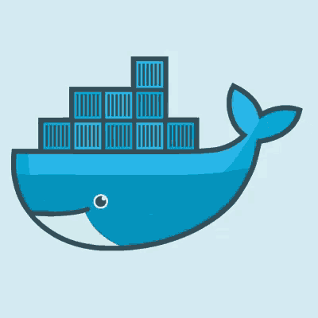

<p align="center">
  
</p>

<p align="center">
  
  
  
</p>

<h1 align="center">🗳️ Application de Vote Distribuée — Dockerisée</h1>

<p align="center">
  <b>Containerisation et orchestration d’une application multi-services avec Docker & Docker Compose.</b>
</p>

---

## 📌 Description

Ce projet consiste à **dockeriser** une application de vote distribuée.

✅ Le code applicatif était **fourni** (Poll / Worker / Result)  
🎯 Mon travail : créer les **Dockerfiles** + le **compose.yml** pour déployer toute l’infrastructure

---

## 🏗️ Architecture

```txt
┌─────────┐      ┌─────────┐      ┌─────────┐      ┌────────────┐      ┌─────────┐
│  Poll   │─────▶│  Redis  │─────▶│ Worker  │─────▶│ PostgreSQL  │◀─────│ Result  │
│ (Flask) │      │ Queue   │      │ (Java)  │      │    DB      │      │ (Node)  │
└─────────┘      └─────────┘      └─────────┘      └────────────┘      └─────────┘
   :5000            :6379                              :5432             :5001
```

---

## ⚙️ Services

- 🗳️ **poll (Flask)** : interface web pour voter → envoie les votes dans Redis  
- 📩 **redis** : file de messages (queue)  
- ⚙️ **worker (Java)** : consomme Redis → écrit en base PostgreSQL  
- 🗄️ **db (PostgreSQL)** : stockage persistant  
- 📊 **result (Node.js)** : affichage des résultats en temps réel  

---

## 🛠️ Technologies utilisées

- **Docker / Docker Compose**
- **Python (Flask)**
- **Java 21 (Maven)**
- **Node.js (Alpine)**
- **Redis**
- **PostgreSQL**

---

## 🚀 Démarrage rapide

```bash
docker-compose up --build
```

### Accès
- ✅ Page de vote : http://localhost:5000  
- ✅ Résultats : http://localhost:5001  

---

## 📁 Structure du projet

```txt
.
├── compose.yml
├── schema.sql
├── poll/
│   └── Dockerfile
├── worker/
│   └── Dockerfile
└── result/
    └── Dockerfile
```

---

## ✅ Contraintes respectées (énoncé)

- ✅ 3 images custom : **poll**, **worker**, **result**
- ✅ 5 services orchestrés via **Docker Compose**
- ✅ Build multi-stage pour **worker**
- ✅ 3 réseaux Docker (**poll-tier**, **back-tier**, **result-tier**)
- ✅ 1 volume nommé : **db-data**
- ✅ Redémarrage automatique des conteneurs (`restart: always`)
- ✅ Pas de `ENTRYPOINT`
- ✅ Configuration via variables d’environnement

---

## 🧰 Commandes utiles

```bash
# Lancer en arrière-plan
docker-compose up -d

# Voir les logs
docker-compose logs -f

# Stopper
docker-compose down

# Stopper + supprimer les volumes
docker-compose down -v
```

---

## 👤 Auteur

Victor Galian
